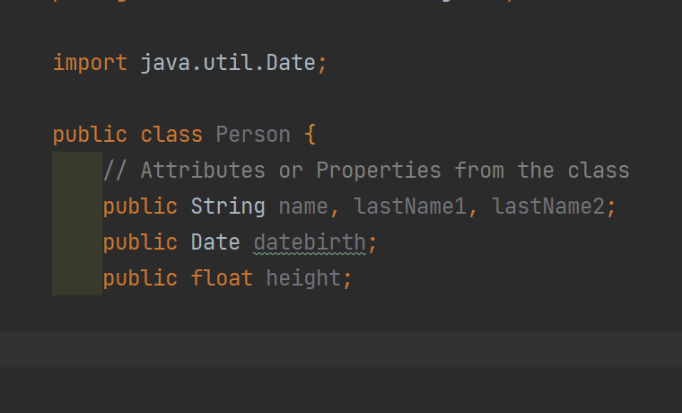
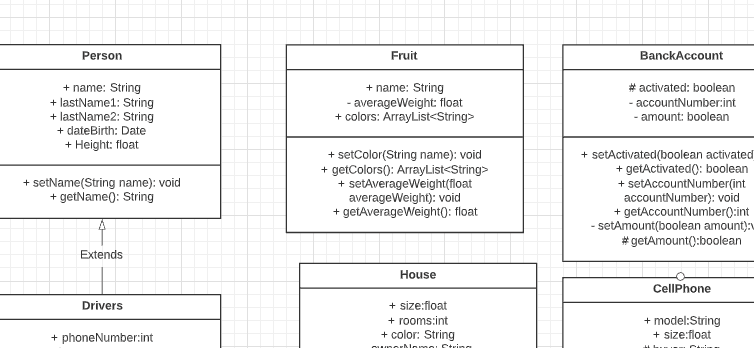
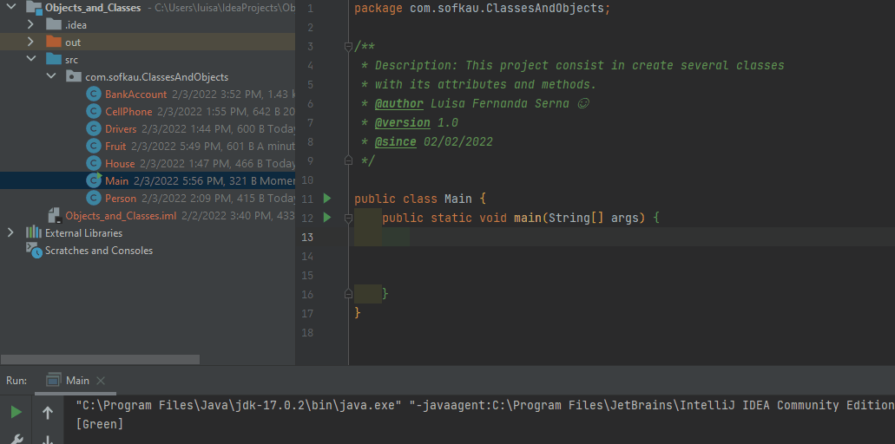
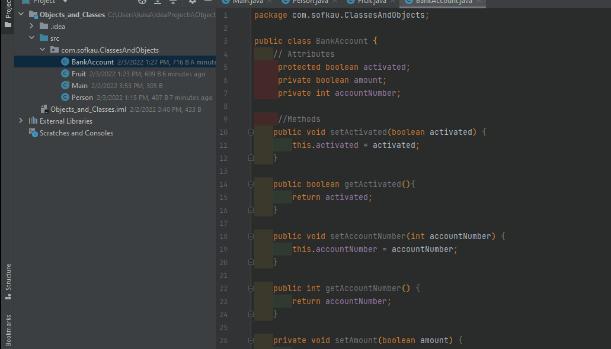
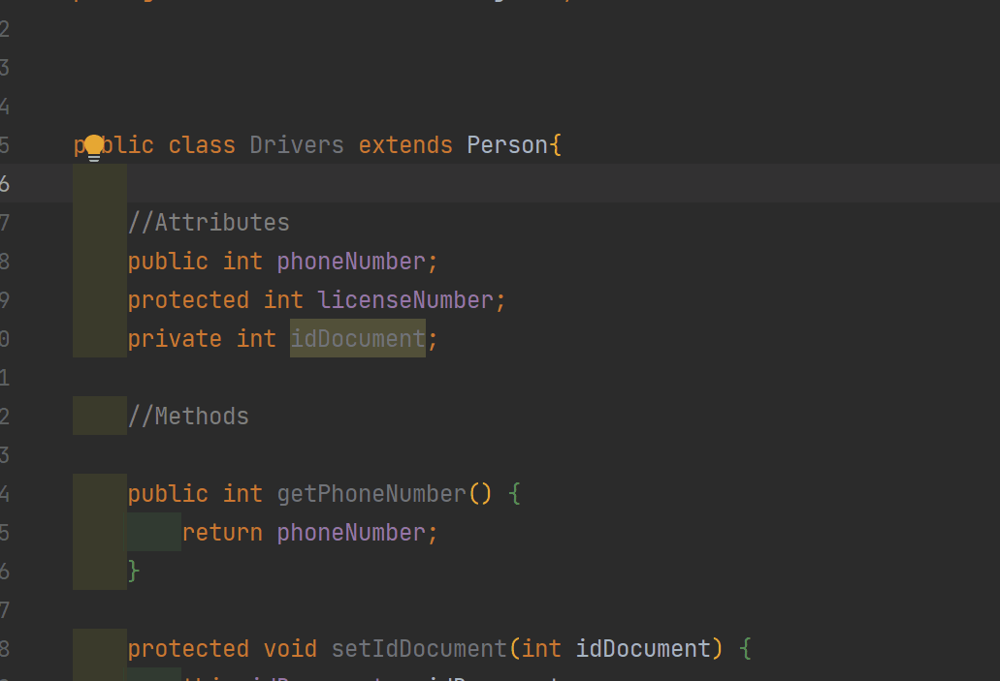

## Welcome to OOP with Java! 👋
# How to create a Class and Object in java? Let's take a look!

*First let's define what is a class:*
A **Class** describe a template with attributes or properties ans methods
used to create objects or instances.

Of course, if you create a UML diagram to model your classes its gonna be easiest: 

*Now let's define what is an object:*
An **Object** it's an instance of a class

In oop we can create inheritances between classes using the key word *extends*

**If you have any contribution it'll help me! :)**

